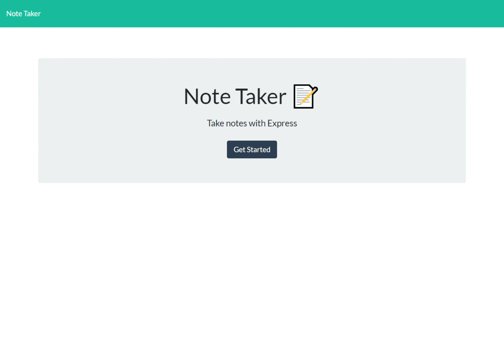
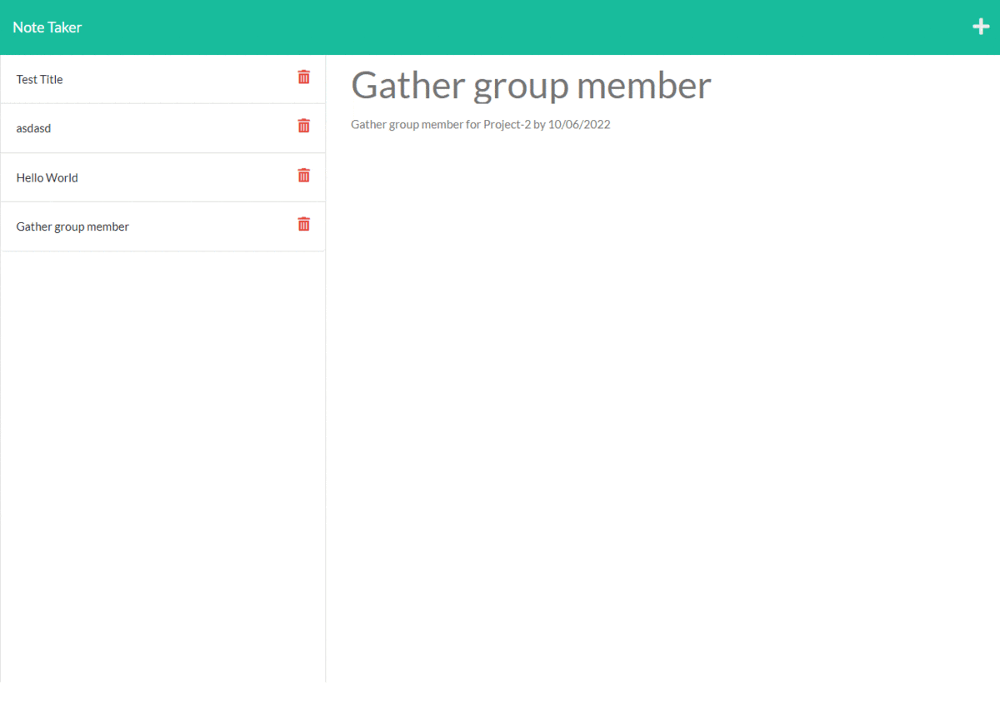

# Flash Note taker 🌟🌌
## This Project is a modify starter code to create an application called Note Taker that can be used to write and save notes. For this application, it will use Express.js back end and will save and retrieve note data from a JSON file.  This app already has a front end setup, It only require student to setup routes and write javascript to connect to database and deploy the application to Heroku.
---
___
## Goal of this Project  
* Modify starter codes. 
* Create routes for index.js and notes.js
* setup post routes, get routes and delete routes. 
* linking routes to path in public folder. 
* use helpers like uuid and utils to help with writing, reading and appending data.
* Test application to write and save notes so that user can organize, keep track of tasks needed to complete.
* deploy the application to Heroku. 
> Most of the hour spend on this application were focused on setting up the routes and connecting the path while also working setup server.js in the root directory. I also utilize helpers like uuid for unique ID number and also utils for readfromFile, writeToFile,readAndAppend. this help me save alot of extra code that I had to do manually. After checking on all setup requirement, I was able to connect the database to the routes and path.
---
___

# Project Content

## 🌟[Repo: Flash Note taker On Github](https://github.com/Young-Chhay/Flash-Notes-Taker "Github Page")
## 🌟[Deployed : Flash Note taker On Heroku](https://desolate-beyond-59572.herokuapp.com/ "Heroku deployed Page")

## 🌟 Adding notes 

## 🌟 Deleting notes 

---
___